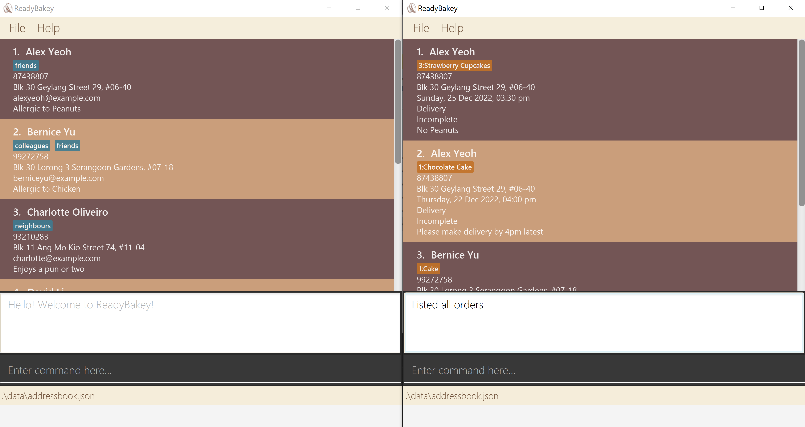

* The project is a desktop application (called _ReadyBakey_) used for managing baking orders.
  * It is **written in OOP fashion** and provides a **reasonably well-written** code base (around 6 KLoC).
  * It comes with a **reasonable level of user and developer documentation**.
* It is a **desktop order management application meant for bakers dealing with lots of orders**. 
  Example usages:
  * as an application to keep track and manage orders received
  * as an application to keep track of past and existing customers
* It is named `ReadyBakey` because it is meant to help bakers get ready for their orders!
* For the detailed documentation of this project, see the **[Ready Bakey Product Website]()**.
* This project is based on the AddressBook-Level3 project created by the [SE-EDU initiative](https://se-education.org).
