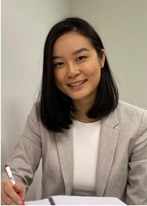
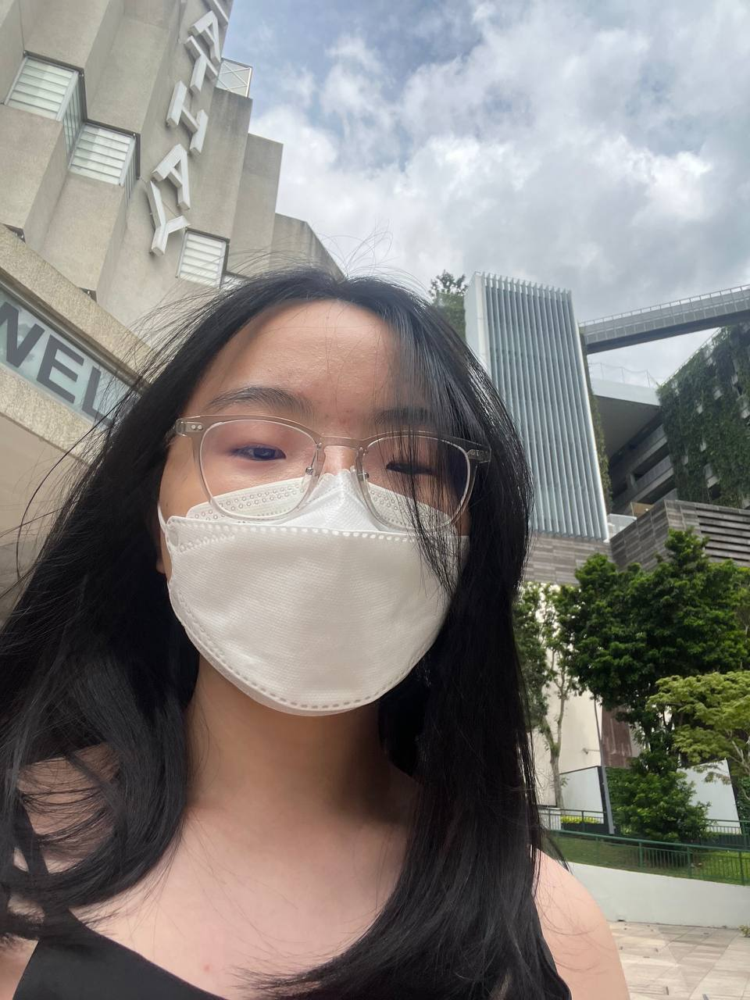
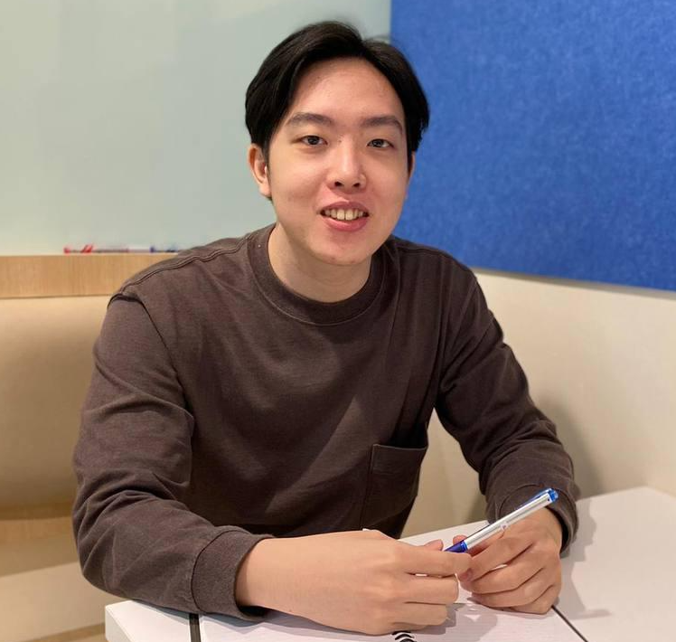
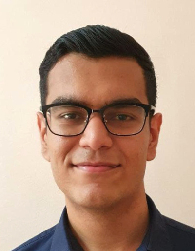

We are a team based in the [School of Computing, National University of Singapore](http://www.comp.nus.edu.sg).

You can reach us at the email `seer[at]comp.nus.edu.sg`

## Project team

### Gerald Tan

[[github](https://github.com/Geralddtan)]
[[portfolio](team/geralddtan.md)]

* Role: Developer
* Responsibilities: Backend

### Pun Hui Min

[[github](https://github.com/punnyhuimin)]
[[portfolio](team/punnyhuimin.md)]

* Role: Developer
* Responsibilities: UI/ UX

### Chua Yi Fang

[[github](http://github.com/onefangg)]
[[portfolio](team/onefangg.md)]

* Role: Developer
* Responsibilities: Data

### Declan Lee Ler

[[github](https://github.com/declanleeler)]
[[portfolio](team/declanleeler.md)]

* Role: Developer
* Responsibilities: Dev Ops + Threading

### Darshan P Daryanani Dave

[[github](http://github.com/darshan152)]

[[portfolio](team/darshan152.md)]

* Role: Developer
* Responsibilities: UI
